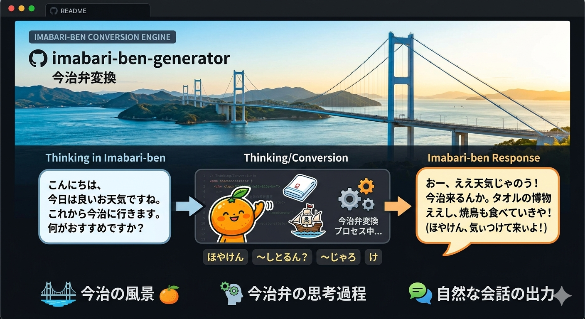

# Imabarize Repository

画像はnanobananaです

※このリポジトリは`https://github.com/foxn2000/sdg`にインスパイアされたレポジトリです。sdgレポジトリはさらに進化し、`foxn2000
sdg_loom`に進化しています。こちらも是非ともご覧ください。


このリポジトリは主に以下の処理を行います。
- `main_create_imabari_qa.py`: テキストや JSON/JSONL から Q&A データを生成
- `main_create_cpt_dataset.py`: テキストや JSON/JSONL から継続事前学習（CPT）用データセットを生成
- `main_extract_wiki.py`: Wikipedia XML ダンプから特定キーワードを含む記事を抽出し JSONL に保存

Q&A 生成、今治弁変換、CPT データセット生成は OpenAI 互換 API（OpenRouter またはローカルサーバー）を利用できます。CPT データセット生成では、必要に応じて入力テキストを箇条書き化してから再度文章化し、文章を再構成した JSONL を保存します。Wikipedia 抽出は API を使わず、XML または `.bz2` 圧縮済み XML を直接パースします。

## 主な機能

- JSON / JSONL / テキスト入力のバッチ処理
- Wikipedia XML / XML.BZ2 ダンプからのキーワード記事抽出
- `target_key` 指定による対象キーの切り替え
- CPT 用の本文正規化・チャンク化・版権対策再構成・train/validation 分割
- バッチ推論（`batch_size`）
- 既処理データのスキップ（`book` + `page` または `id` キャッシュ）
- OpenRouter / ローカル OpenAI 互換 API の切り替え

## リポジトリ構成

- `main_create_imabari_qa.py`: Q&A 生成の実行スクリプト
- `main_create_cpt_dataset.py`: CPT データセット生成の実行スクリプト
- `main_extract_wiki.py`: Wikipedia XML ダンプから今治関連記事を抽出する実行スクリプト
- `pipelines/imabarize_pipeline.py`: 今治弁変換の推論・保存処理
- `pipelines/create_qa_model.py`: Q&A 生成の推論処理
- `pipelines/create_cpt_dataset.py`: CPT 用の正規化・チャンク化・保存処理
- `prompts/imabarize.md`: 今治弁変換プロンプト
- `prompts/create_qa/`: Q&A 生成プロンプト群
- `prompts/create_cpt_set/`: CPT 版権対策用プロンプト群
- `yamls/imabari_settings_format.yaml`: Q&A 生成向け設定テンプレート
- `yamls/cpt_wiki_settings_format.yaml`: CPT 生成向け設定テンプレート
- `test_source/`: 入力サンプル
- `test_output/`: 出力先サンプル

## セットアップ

前提:

- Python 3.11+
- OpenAI互換 Chat Completions API を提供するエンドポイント

### uv（推奨）

```bash
uv sync
```

### venv + pip

```bash
python3 -m venv .venv
source .venv/bin/activate
pip install -r requirements.txt
```

## 実行方法

### A. 今治弁変換（`main_imabarize.py`）

### 1) 設定ファイルを用意

`main_imabarize.py` には `imabarize_prompt` を含む設定が必要です。
現在の `yamls/imabari_settings_format.yaml` は Q&A 生成向けのため、今治弁変換ではそのまま利用できません。

例: `yamls/imabarize_only.yaml`

```yaml
openrouter: true
openrouter_api_key: "YOUR_API_KEY"
openrouter_server_url: "https://openrouter.ai/api/v1"
openrouter_model_name: "qwen/qwen3.5-27b"

SERVER_URL: "http://localhost:8000/v1"
MODEL_NAME: "Qwen3-30B-A3B-Instruct-2507"

infer_config:
  max_tokens: 4096
  temperature: 0
  top_p: 1.0

batch_size: 8
prompts:
  - imabarize_prompt: ./prompts/imabarize.md
output_path: ./test_output/imabarized
max_retries: 3
wait_seconds: 5
```

### 2) 実行

ディレクトリ入力:

```bash
python main_imabarize.py \
  -s ./test_source/dummy \
  -p ./yamls/imabarize_only.yaml \
  -t context \
  -e jsonl
```

単一ファイル入力:

```bash
python main_imabarize.py \
  -s ./test_source/dummy/dummy.jsonl \
  -p ./yamls/imabarize_only.yaml \
  -t context
```

主なCLI引数:

- `-s, --source`: 入力ファイルまたはディレクトリ
- `-p, --settings_path`: YAML設定ファイル
- `-t, --target_key`: 変換対象キー（未指定時は `text`）
- `-e, --extensions`: 対象拡張子（例: `json,jsonl`）
- `-i, --start_index`: 将来の再開処理向け引数（現状は実処理には未反映）

### B. Q&A 生成（`main_create_imabari_qa.py`）

設定テンプレートをコピーして編集:

```bash
cp yamls/imabari_settings_format.yaml yamls/imabari_settings.yaml
```

実行例:

```bash
python main_create_imabari_qa.py \
  -s ./test_source/JaQuAD_jsonls/validation.jsonl \
  -p ./yamls/imabari_settings.yaml \
  -t context
```

### C. CPT データセット生成（`main_create_cpt_dataset.py`）

`test_source/wiki/raw.jsonl` の `content` を使って、継続事前学習向けの `train.jsonl` / `validation.jsonl` を作ります。`copyright_mitigation: true` の場合は、OpenAI 互換 API で「箇条書き化 → 再文章化」を行ってから保存します。

```bash
python main_create_cpt_dataset.py \
  -s ./test_source/wiki/raw.jsonl \
  -p ./yamls/cpt_wiki_settings_format.yaml
```

出力先は YAML の `output_path` で指定します。デフォルトでは以下に保存されます。

```text
test_output/cpt/wiki/all.jsonl
test_output/cpt/wiki/batch_status.jsonl
test_output/cpt/wiki/cache_processed_ids.txt
test_output/cpt/wiki/train.jsonl
test_output/cpt/wiki/validation.jsonl
test_output/cpt/wiki/stats.json
```

主な設定:

- `target_key`: CPT 本文に使う入力キー（Wiki データでは `content`）
- `include_title`: `title` を本文の先頭に付けるか
- `min_chars` / `max_chars` / `overlap_chars`: チャンク化の文字数設定
- `copyright_mitigation`: 版権対策の再構成処理を使うか
- `prompts`: 箇条書き化・再文章化プロンプト
- `batch_size`: API 推論の並列数
- `train_ratio`: train 分割比率
- `text_key`: 出力 JSONL の本文キー（通常は `text`）

### D. Wikipedia XML 抽出（`main_extract_wiki.py`）

Wikipedia の XML ダンプから、タイトルまたは本文に `今治` を含む一般記事を抽出し、CPT 生成などで使いやすい JSONL に保存します。非圧縮 XML と `.bz2` 圧縮済み XML の両方に対応しています。

実行例:

```bash
python main_extract_wiki.py \
  --input ./wiki/jawiki-2026-05-01-p1p2391393.xml.bz2 \
  --output ./test_source/wiki/raw.jsonl \
  --content-threshold 3
```

主なCLI引数:

- `-i, --input`: Wikipedia XML ダンプのパス（デフォルト: `wiki/jawiki-2026-05-01-p1p2391393.xml`）
- `-o, --output`: 出力 JSONL ファイルのパス（デフォルト: `data/imabari/raw.jsonl`）
- `-t, --content-threshold`: 本文に `今治` が何回以上出現したら抽出対象にするか（デフォルト: `3`）

抽出条件:

- namespace `0` の一般記事のみを対象にします。
- リダイレクト記事は除外します。
- タイトルに `今治` を含む記事は抽出します。
- タイトルに含まれない場合でも、本文中の `今治` の出現回数が `content-threshold` 以上なら抽出します。
- 脚注、外部リンク、テンプレート、表、画像リンクなどは可能な範囲で除去し、本文をプレーンテキスト化します。

## 入出力フォーマット

### 入力（JSON / JSONL）

各レコードは辞書形式。`target_key` で指定したキーを変換対象として使用します。  
`target_key` 未指定時は `text` または `content` を探索します。

例:

```json
{"book":"sample_book","page":1,"context":"これはテストです。"}
```

### 出力（JSONL）

Q&A 生成（`main_create_imabari_qa.py`）では、`question` / `thinking` / `answer` などのキーを持つ JSONL が出力されます。

Wikipedia 抽出（`main_extract_wiki.py`）では、以下のように `id` / `title` / `content` を持つ JSONL が出力されます。

```json
{"id":"371","title":"今治市","content":"今治市は、愛媛県の北東部に位置する市..."}
```

CPT データセット生成（`main_create_cpt_dataset.py`）では、以下のように `text` とメタデータを持つ JSONL が出力されます。

```json
{"text":"記事タイトル\n\n本文...", "id":"371", "title":"愛媛県", "source_file":"...", "chunk_index":0}
```

## 再実行時のスキップ仕様

`main_imabarize.py` は `output_path` 配下の既存 JSONL を読み、`book` と `page` が一致する入力レコードをスキップします。  
`main_create_imabari_qa.py` はキャッシュファイルを使って `id` 単位で重複処理を避けます。

## ライセンス
Apache License 2.0です。
`LICENSE` を参照してください。
