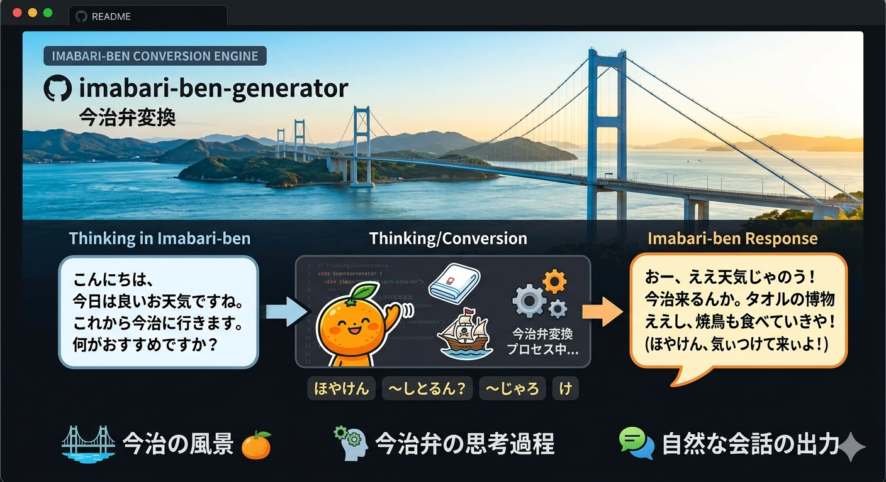

# Imabarize Repository

画像はnanobananaです

※このリポジトリは`https://github.com/foxn2000/sdg`にインスパイアされたレポジトリです。sdgレポジトリはさらに進化し、`foxn2000
sdg_loom`に進化しています。こちらも是非ともご覧ください。


このリポジトリは主に以下の処理を行います。
- `main_create_imabari_qa.py`: テキストや JSON/JSONL から Q&A データを生成
- `main_create_imabari_qa_httpx.py`: vLLM などの OpenAI 互換サーバー向けに、httpx 非同期リクエストで Q&A データを高速生成
- `main_create_imabari_qa_httpx_pipeline_pool.py`: `asyncio.Queue` と `asyncio.create_task` による worker pool 方式で Q&A データを逐次生成
- `main_create_eval_qa_httpx_pipeline_pool.py`: worker pool 方式で評価用 Q&A データセットを生成
- `main_judge_eval_qa_httpx_pipeline_pool.py`: 評価用 Q&A と回答 JSONL を外部 LLM で LLM-as-a-Judge 採点
- `main_create_cpt_dataset.py`: テキストや JSON/JSONL から継続事前学習（CPT）用データセットを生成
- `main_create_cpt_dataset_httpx_pipeline_pool.py`: `asyncio.Queue` と `asyncio.create_task` による worker pool 方式で CPT データセットを逐次生成
- `main_create_grpo_qa_httpx_pipeline_pool.py`: CPT 生成済み JSONL から GRPO 向け4択 Q&A データセットを生成
- `main_upload_cpt_dataset.py`: 生成済み CPT データセットを Hugging Face Hub にアップロード
- `main_extract_wiki.py`: Wikipedia XML ダンプから特定キーワードを含む記事を抽出し JSONL に保存

Q&A 生成、今治弁変換、CPT データセット生成は OpenAI 互換 API（OpenRouter またはローカルサーバー）を利用できます。CPT データセット生成では、必要に応じて入力テキストを箇条書き化してから再度文章化し、文章を再構成した JSONL を保存します。Wikipedia 抽出は API を使わず、XML または `.bz2` 圧縮済み XML を直接パースします。

## 主な機能

- JSON / JSONL / テキスト入力のバッチ処理
- Wikipedia XML / XML.BZ2 ダンプからのキーワード記事抽出
- `target_key` 指定による対象キーの切り替え
- CPT 用の本文正規化・チャンク化・版権対策再構成・train/validation 分割
- バッチ推論（`batch_size`）
- `httpx.AsyncClient` による非同期 Q&A 生成
- `asyncio.Queue` と `asyncio.create_task` による worker pool 型 Q&A / CPT パイプライン
- `max_in_flight` による vLLM / OpenAI 互換 API への同時リクエスト数制御
- 生成結果の到着順保存と、失敗レコードの `.failures.jsonl` 保存
- 評価用 Q&A データセット生成と LLM-as-a-Judge 採点
- GRPO / RL 用の4択 Q&A データセット生成
- 既処理データのスキップ（`book` + `page` または `id` キャッシュ）
- OpenRouter / ローカル OpenAI 互換 API の切り替え
- 一部作成者の都合により使っていない機能があります
- 実にくだらない、でも私にとって満足感の高いリポジトリです

## リポジトリ構成

- `main_create_imabari_qa.py`: Q&A 生成の実行スクリプト
- `main_create_imabari_qa_httpx.py`: Q&A 生成の httpx 非同期版実行スクリプト
- `main_create_imabari_qa_httpx_pipeline_pool.py`: Q&A 生成の Queue / worker pool 非同期版実行スクリプト
- `main_create_eval_qa_httpx_pipeline_pool.py`: 評価用 Q&A 生成の Queue / worker pool 非同期版実行スクリプト
- `main_judge_eval_qa_httpx_pipeline_pool.py`: 評価用 Q&A の LLM-as-a-Judge 実行スクリプト
- `main_create_cpt_dataset.py`: CPT データセット生成の実行スクリプト
- `main_create_cpt_dataset_httpx_pipeline_pool.py`: CPT データセット生成の Queue / worker pool 非同期版実行スクリプト
- `main_create_grpo_qa_httpx_pipeline_pool.py`: GRPO 向け4択 Q&A 生成の Queue / worker pool 非同期版実行スクリプト
- `main_upload_cpt_dataset.py`: CPT データセットの Hugging Face Hub アップロードスクリプト
- `main_extract_wiki.py`: Wikipedia XML ダンプから今治関連記事を抽出する実行スクリプト
- `pipelines/imabarize_pipeline.py`: 今治弁変換の推論・保存処理
- `pipelines/create_qa_model.py`: Q&A 生成の推論処理
- `pipelines/create_qa_model_httpx.py`: Q&A 生成の httpx 非同期推論処理
- `pipelines/create_qa_model_httpx_pipeline_pool.py`: Queue / worker pool 方式の httpx 非同期 Q&A 推論処理
- `pipelines/judge_eval_qa_httpx_pipeline_pool.py`: Queue / worker pool 方式の LLM-as-a-Judge 採点処理
- `pipelines/create_cpt_dataset.py`: CPT 用の正規化・チャンク化・保存処理
- `pipelines/create_cpt_dataset_httpx_pipeline_pool.py`: Queue / worker pool 方式の httpx 非同期 CPT 生成処理
- `pipelines/create_rl_qa_httpx_pipeline_pool.py`: Queue / worker pool 方式の httpx 非同期 GRPO 4択 Q&A 生成処理
- `prompts/imabarize.md`: 今治弁変換プロンプト
- `prompts/create_qa/`: Q&A 生成プロンプト群
- `prompts/judge_eval_qa/`: LLM-as-a-Judge 採点プロンプト群
- `prompts/create_cpt/`: CPT 版権対策用プロンプト群
- `prompts/create_rl_qa/`: GRPO 4択 Q&A 生成プロンプト群
- `yamls/imabari_settings_format.yaml`: Q&A 生成向け設定テンプレート
- `yamls/eval_qa_settings_format.yaml`: 評価用 Q&A 生成向け設定テンプレート
- `yamls/judge_eval_qa_settings_format.yaml`: LLM-as-a-Judge 採点向け設定テンプレート
- `yamls/cpt_wiki_settings_format.yaml`: CPT 生成向け設定テンプレート
- `yamls/create_rl_qa_settings_format.yaml`: GRPO 4択 Q&A 生成向け設定テンプレート
- `test_source/`: 入力サンプル
- `test_output/`: 出力先サンプル

## 成果物の例
[JaQuAD_imabari_v1](https://huggingface.co/datasets/ikedachin/JaQuAD_imabari_v1)  
[JaQuAD_imabari_v2](https://huggingface.co/datasets/ikedachin/JaQuAD_imabari_v2)


## セットアップ

前提:

- Python 3.11+
- OpenAI互換 Chat Completions API を提供するエンドポイント

### uv（推奨）

```bash
uv sync
```

### venv + pip

```bash
python3 -m venv .venv
source .venv/bin/activate
pip install -r requirements.txt
```

## 実行方法

### A. Q&A 生成

設定テンプレートをコピーして編集:

```bash
cp yamls/imabari_settings_format.yaml yamls/imabari_settings.yaml
```

#### A-1. 同期版（`main_create_imabari_qa.py`）

既存の同期版です。シンプルな処理確認や低並列での生成に使います。

```bash
python main_create_imabari_qa.py \
  -s ./test_source/JaQuAD_jsonls/validation.jsonl \
  -p ./yamls/imabari_settings.yaml \
  -t context
```

#### A-2. httpx 非同期版（`main_create_imabari_qa_httpx.py`）

vLLM などのローカル OpenAI 互換サーバーを高負荷で回したい場合は、httpx 非同期版を使えます。既存の同期版ファイルは残したまま、以下の2ファイルで動作します。

- `main_create_imabari_qa_httpx.py`
- `pipelines/create_qa_model_httpx.py`

実行例:

```bash
python main_create_imabari_qa_httpx.py \
  -s ./test_source/JaQuAD_jsonls/validation.jsonl \
  -p ./yamls/imabari_settings.yaml \
  -t context
```

#### A-3. Queue / worker pool 非同期版（`main_create_imabari_qa_httpx_pipeline_pool.py`）

`asyncio.Queue` に入力 item を積み、`asyncio.create_task` で起動した複数 worker が item ごとに Q&A 生成の各 step を進める版です。Step 単位で全件完了を待つ同期バリアを置かず、処理できる item から逐次進みます。

以下の2ファイルで動作します。

- `main_create_imabari_qa_httpx_pipeline_pool.py`
- `pipelines/create_qa_model_httpx_pipeline_pool.py`

実行例:

```bash
python main_create_imabari_qa_httpx_pipeline_pool.py \
  -s ./test_source/JaQuAD_jsonls/validation.jsonl \
  -p ./yamls/imabari_settings.yaml \
  -t context
```

主な特徴:

- `asyncio.Queue` に item id を投入し、worker が item 単位で step 1 から step 5 まで処理します。
- worker は `asyncio.create_task` で起動されます。
- worker 数は `min(max_in_flight, 入力件数)` で決まります。
- `max_in_flight` はパイプライン全体で同時に vLLM / OpenAI 互換 API へ投げてよい最大リクエスト数です。
- 結果は `on_result` callback で到着次第 JSONL に追記されます。
- 失敗した item は処理全体を止めず、`.failures.jsonl` に保存されます。
- JSON/JSONL 入力では `id` と `chunk_index` の組み合わせをキャッシュキーにできるため、CPT チャンク由来の入力も再実行しやすくなっています。

httpx 非同期版と Queue / worker pool 非同期版で追加利用できる主な設定:

```yaml
batch_size: 8
max_in_flight: 8
pipeline_batch_size: 32
max_connections: 16
max_keepalive_connections: 8
connect_timeout: 5
pool_timeout: 30
keepalive_expiry: 120
http2: false
```

- `max_in_flight`: vLLM サーバーに同時送信する最大リクエスト数。GPU使用率を見ながら調整します。
- `pipeline_batch_size`: 入力処理窓の目安です。Queue / worker pool 版ではログ上 `input_window_hint` として表示されます。
- `max_connections` / `max_keepalive_connections`: httpx の接続プール設定です。基本は `max_in_flight` 以上にします。
- `read_timeout`: 1リクエストの応答待ち上限です。パイプライン全体の制限時間ではありません。
- `connect_timeout` / `pool_timeout`: 接続確立と接続プール待ちの timeout です。
- `http2`: vLLM の OpenAI 互換サーバーでは HTTP/1.1 のまま安定することが多いため、デフォルトは `false` です。

`thinking_enabled_by_step` を設定すると、step ごとに `chat_template_kwargs.enable_thinking` を切り替えられます。

```yaml
thinking_enabled_by_step:
  question: true
  answer: true
  thinking: true
  refine_answer: false
  eval: false
```

### B. 評価用 Q&A データセット生成

評価用 Q&A は既存の Q&A JSONL と同じ形式で出力します。実装は `main_create_imabari_qa_httpx_pipeline_pool.py` と同じ worker pool 型の生成処理を使い、評価用途の設定テンプレートを分けています。

設定テンプレートをコピーして編集:

```bash
cp yamls/eval_qa_settings_format.yaml yamls/eval_qa_settings.yaml
```

実行例:

```bash
python main_create_eval_qa_httpx_pipeline_pool.py \
  -s ./test_source/JaQuAD_jsonls/validation.jsonl \
  -p ./yamls/eval_qa_settings.yaml \
  -t context
```

出力先は YAML の `output_path` で指定します。出力レコードは `id` / `chunk_index` / `source_files` / `question` / `thinking` / `answer` / `eval` / `qa_generator` / `messages` を持つ既存 Q&A 互換 JSONL です。JSON/JSONL 入力では `id` と `chunk_index` を組み合わせた cache key で再実行済みレコードをスキップします。

### C. LLM-as-a-Judge 評価

`main_judge_eval_qa_httpx_pipeline_pool.py` は、評価用 Q&A JSONL と評価対象モデルの回答 JSONL を突合し、外部 LLM で採点します。このスクリプトは評価対象モデルの回答生成は行いません。

設定テンプレートをコピーして編集:

```bash
cp yamls/judge_eval_qa_settings_format.yaml yamls/judge_eval_qa_settings.yaml
```

評価対象モデルの回答 JSONL は、最低限以下のキーを持たせます。

```json
{"id":"371","chunk_index":0,"question":"...","answer":"評価対象モデルの回答"}
```

`question` は任意です。突合は `id` と `chunk_index` を優先し、`chunk_index` がないデータでは `id` 単位でも扱えます。回答本文のキー名を変えたい場合は YAML の `candidate_answer_key` を変更します。

実行例:

```bash
python main_judge_eval_qa_httpx_pipeline_pool.py \
  -q ./test_output/eval_qa/validation.jsonl \
  -a ./test_output/eval_answers/answers.jsonl \
  -p ./yamls/judge_eval_qa_settings.yaml
```

Judge の出力は YAML の `output_path` に保存されます。

- `all.jsonl`: `id` / `chunk_index` / `question` / `reference_answer` / `candidate_answer` / `judge_score` / `judge_label` / `judge_reason` / `judge_model`
- `all.failures.jsonl`: 採点に失敗したレコード。`failed_step` / `error` / `previous_outputs` を保存します。
- `cache_processed_ids.txt`: 再実行時に採点済みレコードをスキップする cache key。
- `stats.json`: 保存件数、失敗件数、ラベル別件数などの集計。

`judge_score` は 1 から 5 の整数、`judge_label` は `correct` / `partially_correct` / `incorrect` / `unjudgeable` のいずれかです。

### D. CPT データセット生成

`test_source/wiki/raw.jsonl` の `content` を使って、継続事前学習向けの `train.jsonl` / `validation.jsonl` を作ります。`copyright_mitigation: true` の場合は、OpenAI 互換 API で「箇条書き化 → 再文章化」を行ってから保存します。

#### D-1. 同期版（`main_create_cpt_dataset.py`）

```bash
python main_create_cpt_dataset.py \
  -s ./test_source/wiki/raw.jsonl \
  -p ./yamls/cpt_wiki_settings_format.yaml
```

#### D-2. Queue / worker pool 非同期版（`main_create_cpt_dataset_httpx_pipeline_pool.py`）

`asyncio.Queue` にCPTチャンク候補を積み、`asyncio.create_task` で起動した複数workerが空き次第「箇条書き化 → 再文章化 → 保存用chunk作成」を進めます。`max_in_flight` はパイプライン全体で同時に vLLM / OpenAI 互換 API へ投げてよい最大リクエスト数です。

```bash
python main_create_cpt_dataset_httpx_pipeline_pool.py \
  -s ./test_source/wiki/raw.jsonl \
  -p ./yamls/cpt_wiki_settings_format.yaml
```

主な特徴:

- 既存の `main_create_cpt_dataset.py` / `pipelines/create_cpt_dataset.py` は残したまま使えます。
- `copyright_mitigation: true` の場合だけHTTPリクエストを行います。
- `copyright_mitigation: false` ではworker pool経由でもHTTPなしで通常のCPT chunkを作ります。
- 候補単位の失敗は全体を止めず、`all.failures.jsonl` に `id` / `chunk_index` / `failed_step` / `error` を保存します。
- 失敗候補があるentryはcache済みにしないため、再実行時に未完了entryを処理できます。

出力先は YAML の `output_path` で指定します。デフォルトでは以下に保存されます。

```text
test_output/cpt/wiki/all.jsonl
test_output/cpt/wiki/all.failures.jsonl
test_output/cpt/wiki/batch_status.jsonl
test_output/cpt/wiki/cache_processed_ids.txt
test_output/cpt/wiki/train.jsonl
test_output/cpt/wiki/validation.jsonl
test_output/cpt/wiki/stats.json
```

主な設定:

- `target_key`: CPT 本文に使う入力キー（Wiki データでは `content`）
- `include_title`: `title` を本文の先頭に付けるか
- `min_chars` / `max_chars` / `overlap_chars`: チャンク化の文字数設定。`copyright_mitigation: true` の場合は1リクエストが重くなるため、Qwen3系のローカルvLLMでは `max_chars: 512` 程度から確認します。
- `copyright_mitigation`: 版権対策の再構成処理を使うか
- `copyright_mitigation_failure_policy`: `original` なら版権対策再構成に失敗したchunkを元テキストで保存して完走を優先します。`fail` なら `.failures.jsonl` に保存します。
- `prompts`: 箇条書き化・再文章化プロンプト
- `batch_size`: API 推論の並列数
- `max_in_flight`: 非同期版で同時送信する最大リクエスト数。未指定時は `batch_size` を使います。
- `pipeline_batch_size`: 非同期版の入力処理窓の目安です。ログ上 `input_window_hint` として表示されます。
- `max_connections` / `max_keepalive_connections`: httpx の接続プール設定です。
- `read_timeout`: 1リクエストの応答待ち上限です。パイプライン全体の制限時間ではありません。
- `connect_timeout` / `pool_timeout`: 接続確立と接続プール待ちの timeout です。
- `keepalive_expiry`: keep-alive 接続を維持する秒数です。
- `http2`: HTTP/2 を使うかどうかです。vLLM の OpenAI 互換サーバーでは HTTP/1.1 のまま安定することが多いため、デフォルトは `false` です。
- `cpt_enable_thinking`: Qwen3 などの thinking 対応モデルに `chat_template_kwargs.enable_thinking` を送るかどうかです。`false` でCPT生成時のthinkingを無効化し、未指定ならサーバー側の既定値を使います。
- `train_ratio`: train 分割比率
- `text_key`: 出力 JSONL の本文キー（通常は `text`）

### E. GRPO 向け4択 Q&A データセット生成

`test_output/cpt/wiki/all.jsonl` の `text` を参照情報として使い、GRPO / RL 用の4択 Q&A データセットを作ります。既存の Q&A / CPT 生成スクリプトは残したまま、以下の2ファイルで動作します。

- `main_create_grpo_qa_httpx_pipeline_pool.py`
- `pipelines/create_rl_qa_httpx_pipeline_pool.py`

実行例:

```bash
python main_create_grpo_qa_httpx_pipeline_pool.py \
  -p ./yamls/create_rl_qa_settings_format.yaml
```

入力を明示する場合:

```bash
python main_create_grpo_qa_httpx_pipeline_pool.py \
  -s ./test_output/cpt/wiki/all.jsonl \
  -p ./yamls/create_rl_qa_settings_format.yaml
```

パイプラインは item ごとに以下の4 stepを順に実行します。

1. 参照情報をもとに標準語の問題文を作成
2. 参照情報なしで同じモデルに回答させる
3. 参照情報ありで正確な回答と根拠を作成
4. 無参照回答と参照あり回答を比較し、RL 用の4択選択肢と適性判定を作成

主な特徴:

- 有効な入力行から `seed` 固定で最大 `sample_size` 件をランダム抽出します。
- `asyncio.Queue` に item id を投入し、worker が item 単位で step 1 から step 4 まで処理します。
- worker 数は `min(max_in_flight, 入力件数)` で決まります。
- `max_in_flight` はパイプライン全体で同時に OpenAI 互換 API へ投げてよい最大リクエスト数です。
- `pipeline_batch_size` は入力処理窓の目安で、ログ上 `input_window_hint` として表示されます。
- 成功した item は `all.jsonl` に保存し、`rl_suitability == "accepted"` の行を学習対象として使えます。
- 失敗した item は `all.failures.jsonl` に `failed_step` / `error` / `previous_outputs` を保存します。
- 再実行時は `cache_processed_ids.txt` の `id + chunk_index` で成功済み item をスキップします。

デフォルト出力:

```text
test_output/rl_qa/wiki/all.jsonl
test_output/rl_qa/wiki/all.failures.jsonl
test_output/rl_qa/wiki/cache_processed_ids.txt
test_output/rl_qa/wiki/stats.json
```

主な設定:

- `source_path`: 入力 JSONL（デフォルトは `./test_output/cpt/wiki/all.jsonl`）
- `target_key`: 参照情報として使う本文キー（CPT 出力では `text`）
- `sample_size`: ランダム抽出する最大件数
- `seed`: ランダム抽出の固定 seed
- `prompts`: `prompts/create_rl_qa/` 配下の4 step 用プロンプト
- `thinking_enabled_by_step`: step ごとの `chat_template_kwargs.enable_thinking` 切り替え

### F. データセットのアップロード（`main_upload_dataset.py`）

生成済みの CPT / QA / GRPO データセットを Hugging Face Hub の dataset repository にアップロードします。デフォルトでは `all.jsonl` を canonical なアップロード対象にし、`--include-splits` を付けた場合だけ `train.jsonl` / `validation.jsonl` もアップロードします。

アップロード前に JSONL record から除外するキーは `--exclude-upload-key` または `--exclude-upload-keys` で指定できます。デフォルトでは `item_id` のみ除外します。

dry-run:

```bash
python main_upload_dataset.py \
  --repo_id YOUR_NAME/YOUR_DATASET \
  --settings_path ./yamls/cpt_wiki_settings_format.yaml \
  --dry-run \
  --exclude-upload-key source_file \
  --exclude-upload-key copyright_mitigation
```

アップロード:

```bash
python main_upload_dataset.py \
  --repo_id YOUR_NAME/YOUR_DATASET \
  --hf_token YOUR_HF_TOKEN \
  --settings_path ./yamls/cpt_wiki_settings_format.yaml
```

### G. Wikipedia XML 抽出（`main_extract_wiki.py`）

Wikipedia の XML ダンプから、タイトルまたは本文に `今治` を含む一般記事を抽出し、CPT 生成などで使いやすい JSONL に保存します。非圧縮 XML と `.bz2` 圧縮済み XML の両方に対応しています。

実行例:

```bash
python main_extract_wiki.py \
  --input ./wiki/jawiki-2026-05-01-p1p2391393.xml.bz2 \
  --output ./test_source/wiki/raw.jsonl \
  --content-threshold 3
```

主なCLI引数:

- `-i, --input`: Wikipedia XML ダンプのパス（デフォルト: `wiki/jawiki-2026-05-01-p1p2391393.xml`）
- `-o, --output`: 出力 JSONL ファイルのパス（デフォルト: `data/imabari/raw.jsonl`）
- `-t, --content-threshold`: 本文に `今治` が何回以上出現したら抽出対象にするか（デフォルト: `3`）

抽出条件:

- namespace `0` の一般記事のみを対象にします。
- リダイレクト記事は除外します。
- タイトルに `今治` を含む記事は抽出します。
- タイトルに含まれない場合でも、本文中の `今治` の出現回数が `content-threshold` 以上なら抽出します。
- 脚注、外部リンク、テンプレート、表、画像リンクなどは可能な範囲で除去し、本文をプレーンテキスト化します。

## 入出力フォーマット

### 入力（JSON / JSONL）

各レコードは辞書形式。`target_key` で指定したキーを変換対象として使用します。  
`target_key` 未指定時は `text` または `content` を探索します。

例:

```json
{"book":"sample_book","page":1,"context":"これはテストです。"}
```

### 出力（JSONL）

Q&A 生成（`main_create_imabari_qa.py`）では、`question` / `thinking` / `answer` などのキーを持つ JSONL が出力されます。
`main_create_imabari_qa_httpx.py` と `main_create_imabari_qa_httpx_pipeline_pool.py` も同じ形式を出力します。生成に失敗した item は、同名の `.failures.jsonl` に `failed_step` / `error` / `previous_outputs` などを保存します。

Wikipedia 抽出（`main_extract_wiki.py`）では、以下のように `id` / `title` / `content` を持つ JSONL が出力されます。

```json
{"id":"371","title":"今治市","content":"今治市は、愛媛県の北東部に位置する市..."}
```

CPT データセット生成（`main_create_cpt_dataset.py`）では、以下のように `text` とメタデータを持つ JSONL が出力されます。

```json
{"text":"記事タイトル\n\n本文...", "id":"371", "title":"愛媛県", "source_file":"...", "chunk_index":0}
```

GRPO 向け4択 Q&A 生成（`main_create_grpo_qa_httpx_pipeline_pool.py`）では、以下のように問題、4択、正解、無参照回答、参照あり回答、適性判定を持つ JSONL が出力されます。

```json
{"id":"371","chunk_index":0,"title":"愛媛県","question":"...","choices":[{"label":"A","text":"..."},{"label":"B","text":"..."},{"label":"C","text":"..."},{"label":"D","text":"..."}],"correct_label":"A","correct_answer":"...","blind_answer":"...","grounded_answer":"...","evidence":"...","difficulty":"borderline","rl_suitability":"accepted","rejection_reason":"","qa_generator":"Qwen3-30B-A3B-Instruct-2507","messages":[{"role":"user","content":"..."},{"role":"assistant","content":"A. ..."}]}
```

## 再実行時のスキップ仕様

`main_create_imabari_qa.py` と `main_create_imabari_qa_httpx.py` はキャッシュファイルを使って `id` 単位で重複処理を避けます。
`main_create_imabari_qa_httpx_pipeline_pool.py` は `id` に加えて `chunk_index` もキャッシュキーに含められるため、同じ `id` の複数チャンクを個別に扱えます。

## ライセンス
Apache License 2.0です。
`LICENSE` を参照してください。
